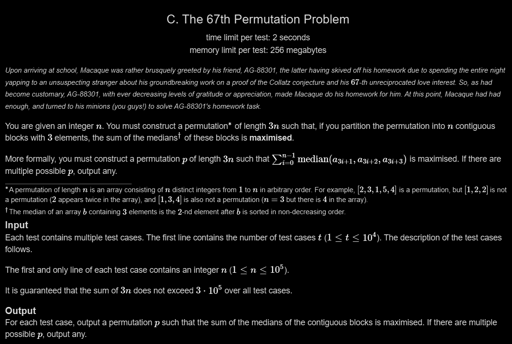

# C. The 67th Permutation Problem

## 🖼 Problem 12


---

**Platform:** Codeforces  
**Topic:** Greedy / Permutation Construction  
**Difficulty:** Medium  

---

## 🧠 Idea in One Line
Place small number with two largest numbers in each block to maximize medians.

---

## 🔍 Key Observation
- Each block has 3 elements
- Median is the middle value
- To maximize medians → make second largest as large as possible
- Pair smallest unused with two largest unused numbers

---

## 🚀 Approach
- Total size = 3n
- Use two pointers
- Start smallest from left
- Largest from right
- Construct blocks: [small, large-1, large]

---

## 🪜 Algorithm Steps
1. Read n
2. Set k = 3*n
3. Loop i from 1 to n
4. Print i, k-1, k
5. Reduce k by 2
6. Continue for all blocks

---

## ⏱ Time Complexity
O(n)

## 📦 Space Complexity
O(1)

---

## ⚠️ Edge Cases
- n = 1
- large n
- multiple test cases
- ensure permutation uniqueness
- no repeated numbers

---

## 💻 Code Pattern to Remember
```cpp
#include <iostream>
using namespace std;

int main() {
    int t;
    cin >> t;
    
    while (t--) {
        int n;
        cin >> n;
        int k = 3 * n;
        
        for (int i = 1; i <= n; i++) {
            cout << i << " " << k - 1 << " " << k << " ";
            k -= 2;
        }
        cout << "\n";
    }
    
    return 0;
}