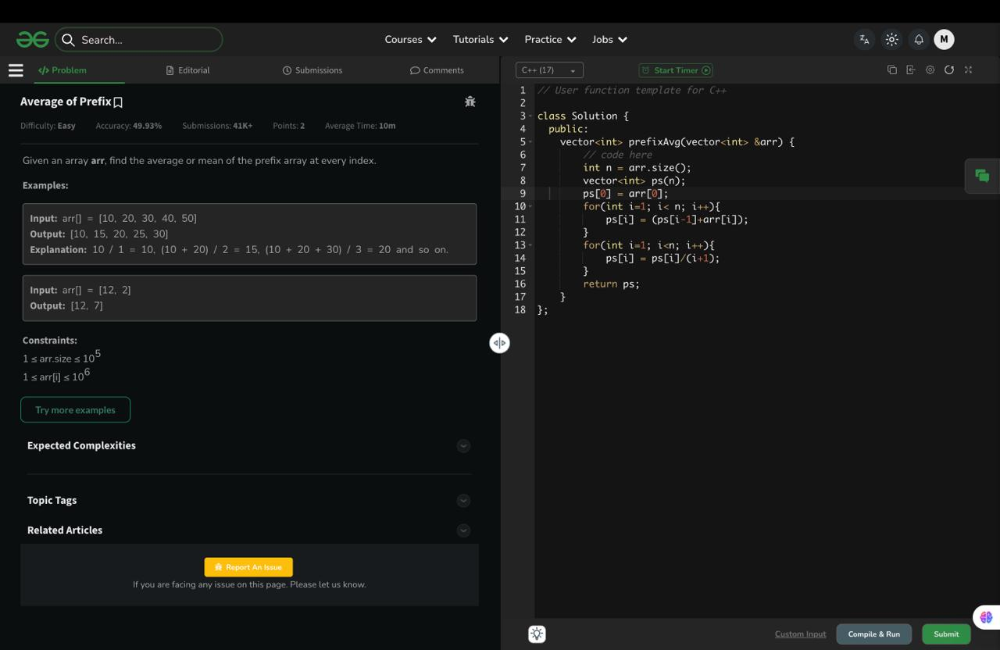

# Average of Prefix

## 🖼 Problem Screenshot


---

**Platform:** GeeksforGeeks  
**Topic:** Prefix Sum / Array  
**Difficulty:** Easy  

---

## 🧠 Idea in One Line
Compute prefix sum and divide by index+1 to get prefix average.

---

## 🔍 Key Observation
Prefix average: avg[i] = (sum of elements from 0 to i) / (i + 1)

---

## 🚀 Approach
- Compute prefix sum array
- Divide each prefix sum by its length
- Store result

---

## 🪜 Algorithm Steps
1. Read array
2. Create prefix sum array
3. Compute prefix sums
4. Loop again and divide by `(i+1)`
5. Return result

---

## ⏱ Time Complexity
O(n)

## 📦 Space Complexity
O(n)

---

## ⚠️ Edge Cases
- single element array
- large values
- increasing sequence
- decreasing sequence
- n = 1

---

## 💻 Code Pattern to Remember
```cpp
class Solution {
public:
    vector<int> prefixAvg(vector<int> &arr) {
        int n = arr.size();
        vector<int> ps(n);

        ps[0] = arr[0];

        for(int i = 1; i < n; i++){
            ps[i] = ps[i-1] + arr[i];
        }

        for(int i = 0; i < n; i++){
            ps[i] = ps[i] / (i+1);
        }

        return ps;
    }
};