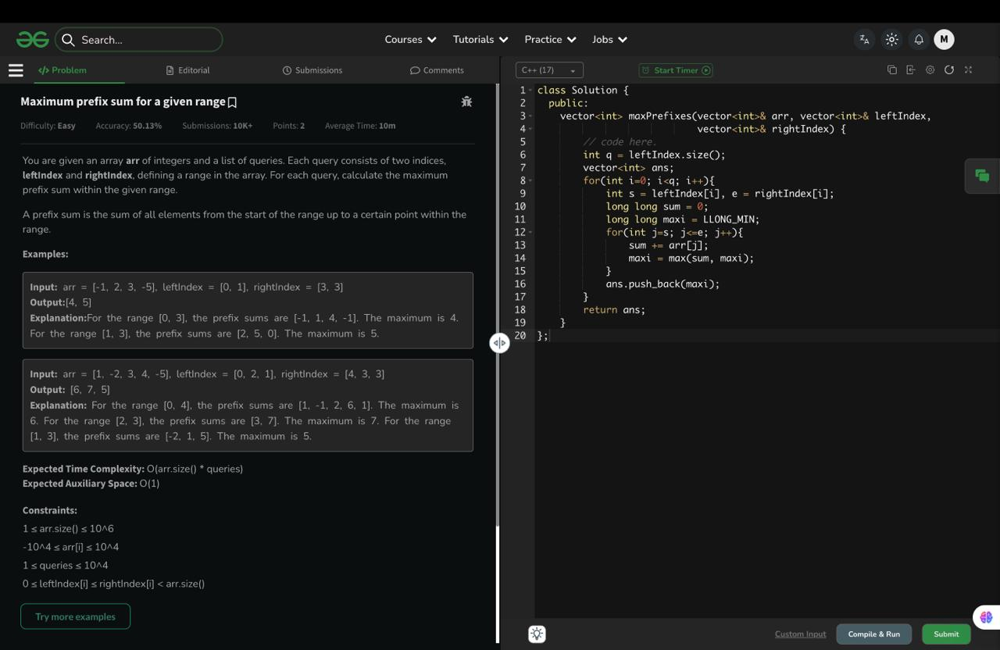

# Maximum prefix sum for a given range

## 🖼 Problem 16


---

**Platform:** GeeksforGeeks  
**Topic:** Prefix Sum / Array  
**Difficulty:** Easy  

---

## 🧠 Idea in One Line
For each query, compute running sum in range and track maximum prefix.

---

## 🔍 Key Observation
For range [L, R]: prefix = arr[L]
prefix = arr[L] + arr[L+1]
...

take maximum of all

---

## 🚀 Approach
- For each query
- Traverse from L to R
- Maintain running sum
- Track maximum

---

## 🪜 Algorithm Steps
1. Read array
2. Read queries
3. For each query get L and R
4. Initialize sum = 0
5. Loop from L to R
6. Update sum
7. Track max prefix
8. Store result

---

## ⏱ Time Complexity
O(n * q)

## 📦 Space Complexity
O(1)

---

## ⚠️ Edge Cases
- single element range
- all negative numbers
- all positive numbers
- large range
- L = R

---

## 💻 Code Pattern to Remember
```cpp
class Solution {
public:
    vector<int> maxPrefixes(vector<int>& arr, vector<int>& leftIndex,
                            vector<int>& rightIndex) {

        int q = leftIndex.size();
        vector<int> ans;

        for(int i = 0; i < q; i++){
            int s = leftIndex[i];
            int e = rightIndex[i];

            long long sum = 0;
            long long maxi = LLONG_MIN;

            for(int j = s; j <= e; j++){
                sum += arr[j];
                maxi = max(sum, maxi);
            }

            ans.push_back(maxi);
        }

        return ans;
    }
};