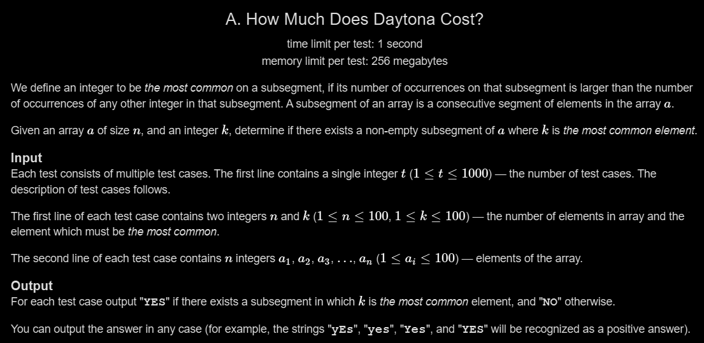

# A. How Much Does Daytona Cost?

## 🖼 Problem 17


---

**Platform:** Codeforces  
**Topic:** Greedy / Implementation  
**Difficulty:** Easy  

---

## 🧠 Idea in One Line
If element k exists in array, answer is YES.

---

## 🔍 Key Observation
- Single element subsegment is allowed
- If k appears once → it is most common in that segment
- So just check presence of k

---

## 🚀 Approach
- Traverse array
- Check if k exists
- Print YES if found

---

## 🪜 Algorithm Steps
1. Read test cases
2. Read `n , k`
3. Read array
4. Check if any element equals k
5. If found print YES
6. Else print NO

---

## ⏱ Time Complexity
O(n)

## 📦 Space Complexity
O(1)

---

## ⚠️ Edge Cases
- k not present
- k present once
- all elements same
- n = 1
- multiple occurrences

---

## 💻 Code Pattern to Remember
```cpp
#include <bits/stdc++.h>
using namespace std;

int main()
{
    int t;
    cin >> t;

    while (t--)
    {
        int n, k;
        cin >> n >> k;

        int arr[n];
        for (int i = 0; i < n; i++)
            cin >> arr[i];

        int flag = 0;

        for (int i = 0; i < n; i++)
        {
            if (arr[i] == k)
            {
                flag = 1;
                break;
            }
        }

        if (flag)
            cout << "YES" << endl;
        else
            cout << "NO" << endl;
    }

    return 0;
}