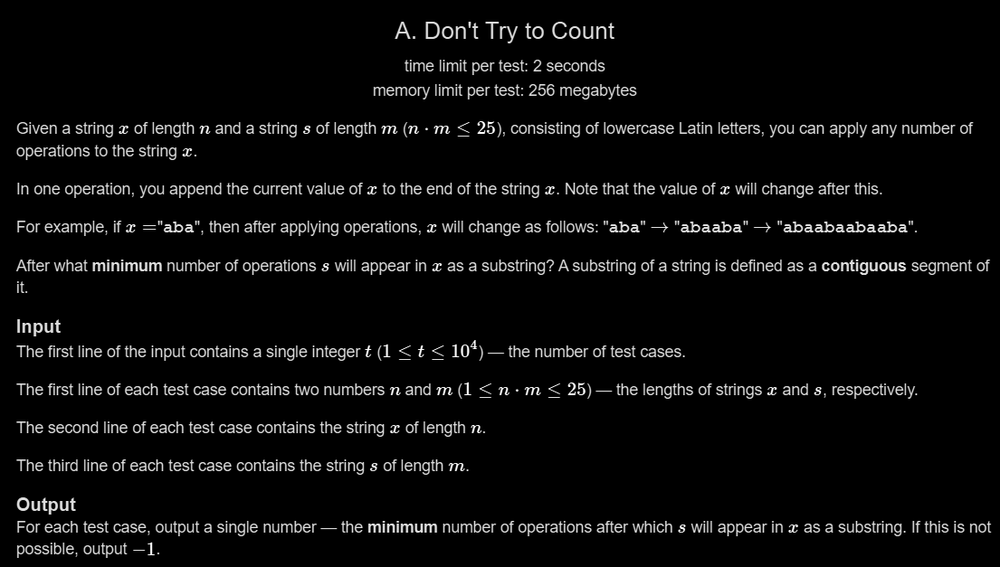

# A. Don't Try to Count

## 🖼 Problem 18


---

**Platform:** Codeforces  
**Topic:** String / Brute Force  
**Difficulty:** Easy  

---

## 🧠 Idea in One Line
Repeatedly double string x and check when s becomes substring.

---

## 🔍 Key Observation
- Each operation doubles string
- Length grows exponentially
- Maximum 5 operations enough (constraint n*m ≤ 25)
- Check substring after each doubling

---

## 🚀 Approach
- Generate strings after each doubling
- Check substring at each step
- Return minimum operation

---

## 🪜 Algorithm Steps
1. Read test cases
2. Read `n , m`
3. Read string `x`
4. Read string `s`
5. Generate doubled strings
6. Check substring each time
7. Print minimum operation or -1

---

## ⏱ Time Complexity
O(1) (small constraint)

## 📦 Space Complexity
O(1)

---

## ⚠️ Edge Cases
- already substring
- never appears
- same strings
- s longer than x
- single character

---

## 💻 Code Pattern to Remember
```cpp
#include <bits/stdc++.h>
using namespace std;

bool subString(string x, string s){
    if(x.size() < s.size()) return false;
    for(int i=0; i< x.size()-s.size()+1; i++){
        if(x.substr(i, s.size()) == s) return true;
    }
    return false;
}

int main(){
    int t;
    cin >> t;

    while(t--){
        int n , m;
        cin >> n >> m;

        string x;
        cin >> x;

        string s;
        cin >> s;

        int oper = 0;

        string x0 = x;
        string x1 = x0 + x0;
        string x2 = x1 + x1;
        string x3 = x2 + x2;
        string x4 = x3 + x3;
        string x5 = x4 + x4;

        if(subString(x0, s)) oper = 0;
        else if(subString(x1, s)) oper = 1;
        else if(subString(x2, s)) oper = 2;
        else if(subString(x3, s)) oper = 3;
        else if(subString(x4, s)) oper = 4;
        else if(subString(x5, s)) oper = 5;
        else oper = -1;

        cout << oper << endl;
    }

    return 0;
}