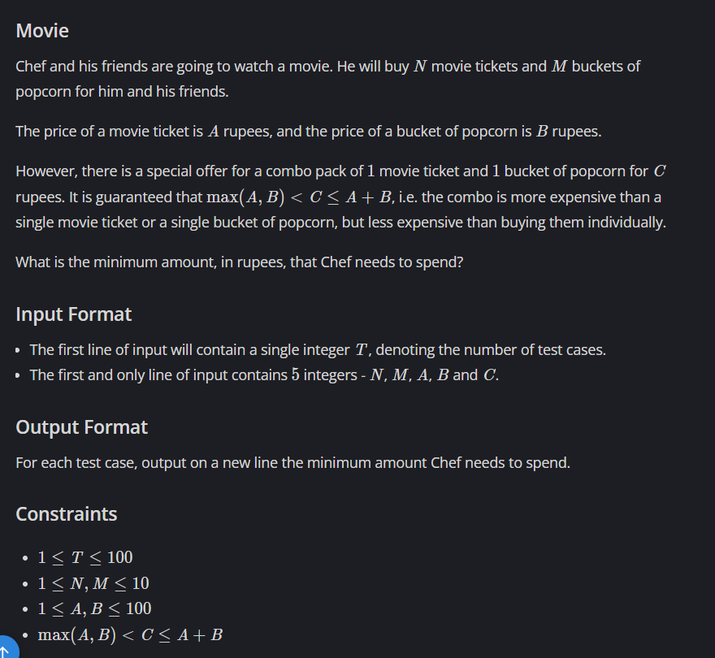

# Movie

## 🖼 Problem 21


---

**Platform:** CodeChef  
**Topic:** Greedy / Math  
**Difficulty:** Easy  

---

## 🧠 Idea in One Line
Use as many combo offers as possible, then buy remaining items separately.

---

## 🔍 Key Observation
- Combo contains 1 ticket + 1 popcorn
- Use combo for minimum of `N` and `M`
- Remaining items bought individually

---

## 🚀 Approach
- Find minimum of N and M
- Use combo for that many
- Remaining tickets → buy with A
- Remaining popcorn → buy with B

---

## 🪜 Algorithm Steps
1. Read test cases
2. Read `N, M, A, B, C`
3. Compute `mn = min(N, M)`
4. Compute cost for combos
5. Add remaining ticket cost
6. Add remaining popcorn cost
7. Print result

---

## ⏱ Time Complexity
O(1)

## 📦 Space Complexity
O(1)

---

## ⚠️ Edge Cases
- N = M
- N > M
- M > N
- single combo only
- no combo used

---

## 💻 Code Pattern to Remember
```cpp
#include <bits/stdc++.h>
using namespace std;

int main() {
	int t;
	cin >> t;

	while(t--){
	    int N, M, A, B, C;
	    cin >> N >> M >> A >> B >> C;

	    int mn = min(N, M);

	    int min_amount = mn*C + (M-mn)*B + (N-mn)*A;

	    cout << min_amount << endl;
	}
}