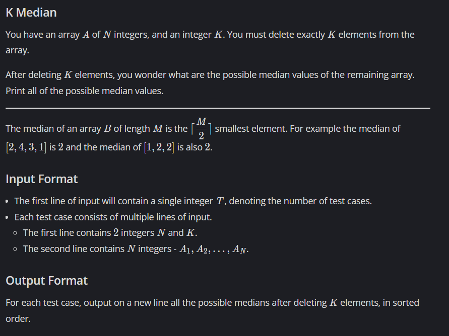

# K Median

## 🖼 Problem 22


---

**Platform:** CodeChef  
**Topic:** Sorting / Greedy  
**Difficulty:** Medium  

---

## 🧠 Idea in One Line
Sort array and possible medians lie between indices `(M-1)/2` and `(M-1)/2 + K`.

---

## 🔍 Key Observation
- After removing K elements → remaining size = `M = N - K`
- Median index = `(M-1)/2`
- Removing elements shifts median within a range
- Possible medians = elements from:
- min_index → max_index
- min_index = (M-1)/2
- max_index = min_index + K


---

## 🚀 Approach
- Sort array
- Compute new size after deletion
- Find median range
- Print unique values in range

---

## 🪜 Algorithm Steps
1. Read test cases
2. Read `N , K`
3. Read array
4. Sort array
5. Compute `M = N - K`
6. Compute `min_index`
7. Compute `max_index`
8. Print unique values in range

---

## ⏱ Time Complexity
O(N log N)

## 📦 Space Complexity
O(N)

---

## ⚠️ Edge Cases
- K = 0
- all elements same
- K = N-1
- duplicates
- small N

---

## 💻 Code Pattern to Remember
```cpp
#include <bits/stdc++.h>
using namespace std;

int main() {
	int t;
	cin >> t;

	while(t--){
	    int N, K;
	    cin >> N >> K;

	    vector<int> v(N);
	    for(int i=0; i<N; i++){
	        cin >> v[i];
	    }

	    sort(v.begin(), v.end());

	    int M = N-K;
	    int min_indx = (M-1)/2;
	    int max_indx = min_indx + K;

	    for(int i=min_indx ; i<= max_indx; i++){
	        if(i == min_indx || v[i] != v[i-1])
	            cout << v[i] << " ";
	    }

	    cout << "\n";
	}
}
