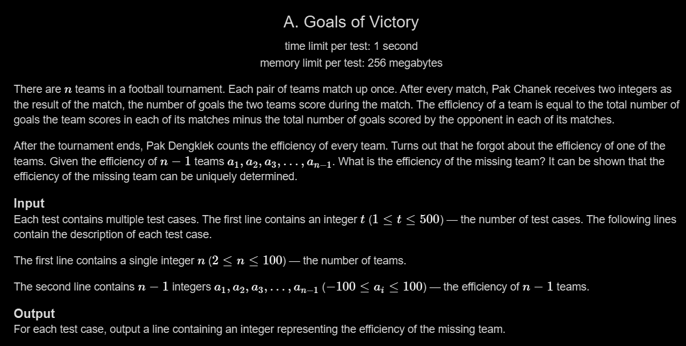

# A. Goals of Victory

## 🖼 Problem 23


---

**Platform:** Codeforces  
**Topic:** Math / Observation  
**Difficulty:** Easy  

---

## 🧠 Idea in One Line
Sum of all efficiencies must be zero, so missing value = negative of sum.

---

## 🔍 Key Observation
- Each goal scored is also conceded by another team
- Total efficiency of all teams = 0
- Missing efficiency = `- (sum of given values)`

---

## 🚀 Approach
- Compute sum of given efficiencies
- Print negative of sum

---

## 🪜 Algorithm Steps
1. Read test cases
2. Read `n`
3. Read `n-1` elements
4. Compute sum
5. Print `-sum`

---

## ⏱ Time Complexity
O(n)

## 📦 Space Complexity
O(1)

---

## ⚠️ Edge Cases
- negative numbers
- all zeros
- n = 2
- large values
- mixed positive negative

---

## 💻 Code Pattern to Remember
```cpp
#include <bits/stdc++.h>
using namespace std;

int main(){
    int t;
    cin >> t;

    while(t--){
        int n;
        cin >> n;

        int arr[n-1];
        for(int i=0; i<n-1; i++){
            cin >> arr[i];
        }

        int sum = 0;
        for(int i=0; i<n-1; i++){
            sum += arr[i];
        }

        cout << -sum << endl;
    }

    return 0;
}