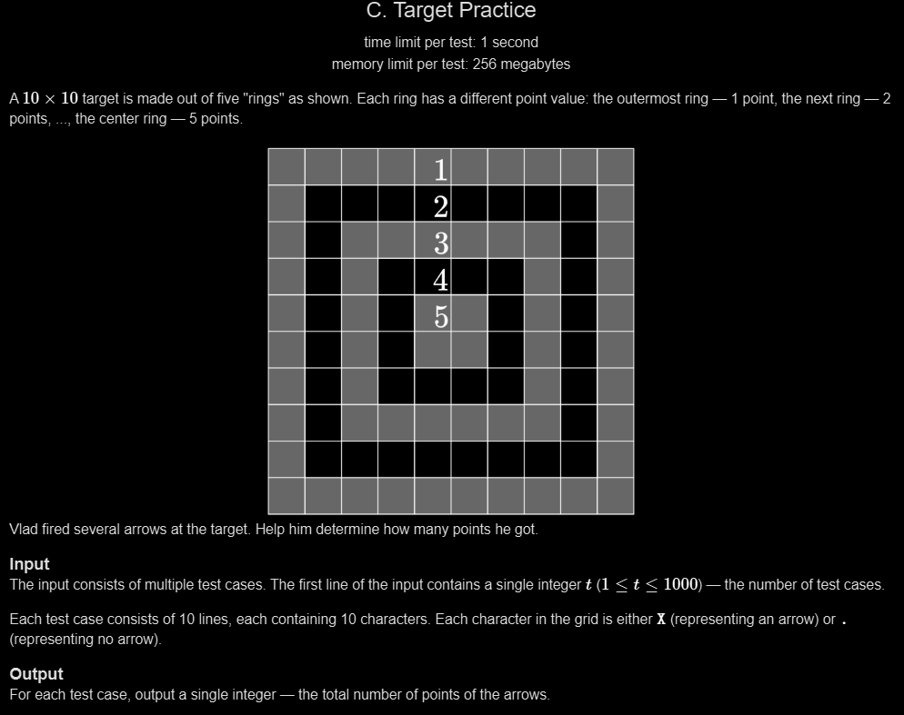

# C. Target Practice

## 🖼 Problem 24


---

**Platform:** Codeforces  
**Topic:** Implementation / Matrix  
**Difficulty:** Easy  

---

## 🧠 Idea in One Line
Use predefined score matrix and sum scores for each 'X'.

---

## 🔍 Key Observation
- Target has fixed 5 rings
- Each cell has fixed score
- Precompute score matrix
- Add score when 'X' found

---

## 🚀 Approach
- Store score grid
- Read input grid
- For each 'X' add score
- Print total

---

## 🪜 Algorithm Steps
1. Define score matrix
2. Read test cases
3. Read 10x10 grid
4. Initialize sum = 0
5. Loop over grid
6. If 'X' add score
7. Print sum

---

## ⏱ Time Complexity
O(100 * t)

## 📦 Space Complexity
O(1)

---

## ⚠️ Edge Cases
- no X
- all X
- single X
- center cell
- boundary cells

---

## 💻 Code Pattern to Remember
```cpp
#include <bits/stdc++.h>
using namespace std;

const int score[10][10] = {
    {1,1,1,1,1,1,1,1,1,1},
    {1,2,2,2,2,2,2,2,2,1},
    {1,2,3,3,3,3,3,3,2,1},
    {1,2,3,4,4,4,4,3,2,1},
    {1,2,3,4,5,5,4,3,2,1},
    {1,2,3,4,5,5,4,3,2,1},
    {1,2,3,4,4,4,4,3,2,1},
    {1,2,3,3,3,3,3,3,2,1},
    {1,2,2,2,2,2,2,2,2,1},
    {1,1,1,1,1,1,1,1,1,1}
};

int main(){
    int t;
    cin >> t;

    char arr[10][10];

    while(t--){
        for(int i=0; i<10; i++){
            string s;
            cin >> s;
            for(int j=0; j<10; j++){
                arr[i][j] = s[j];
            }
        }

        int total_sum = 0;

        for(int i=0; i<10; i++){
            for(int j=0; j<10; j++){
                if(arr[i][j]=='X'){
                    total_sum += score[i][j];
                }
            }
        }

        cout << total_sum << endl;
    }

    return 0;
}