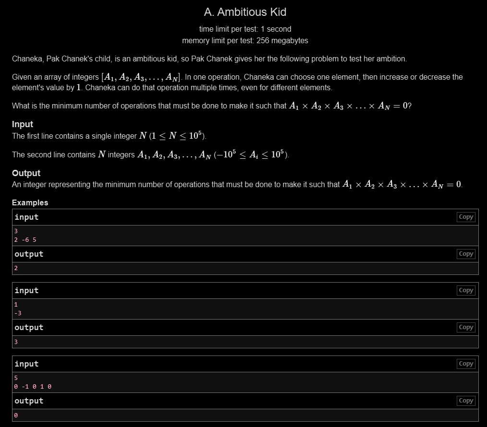

# A. Ambitious Kid

## 🖼 Problem 25


---

**Platform:** Codeforces  
**Topic:** Greedy / Math  
**Difficulty:** Easy  

---

## 🧠 Idea in One Line
Minimum operations equal the smallest absolute value in the array.

---

## 🔍 Key Observation
- Product becomes zero if any element becomes zero
- We can change any element by ±1
- Minimum operations = convert closest element to zero
- Closest to zero = minimum absolute value

---

## 🚀 Approach
- Find minimum absolute value
- That is the number of operations

---

## 🪜 Algorithm Steps
1. Read `n`
2. Read array
3. Initialize `mn = INT_MAX`
4. Loop through array
5. Update `mn = min(mn, abs(arr[i]))`
6. Print `mn`

---

## ⏱ Time Complexity
O(n)

## 📦 Space Complexity
O(1)

---

## ⚠️ Edge Cases
- array contains zero → answer 0
- all negative numbers
- all positive numbers
- single element
- large values

---

## 💻 Code Pattern to Remember
```cpp
#include <bits/stdc++.h>
using namespace std;

int main()
{
    int n;
    cin >> n;

    int arr[n];
    for (int i = 0; i < n; i++)
        cin >> arr[i];

    int mn = INT_MAX;

    for (int i = 0; i < n; i++)
        mn = min(mn, abs(arr[i]));

    cout << mn << endl;

    return 0;
}