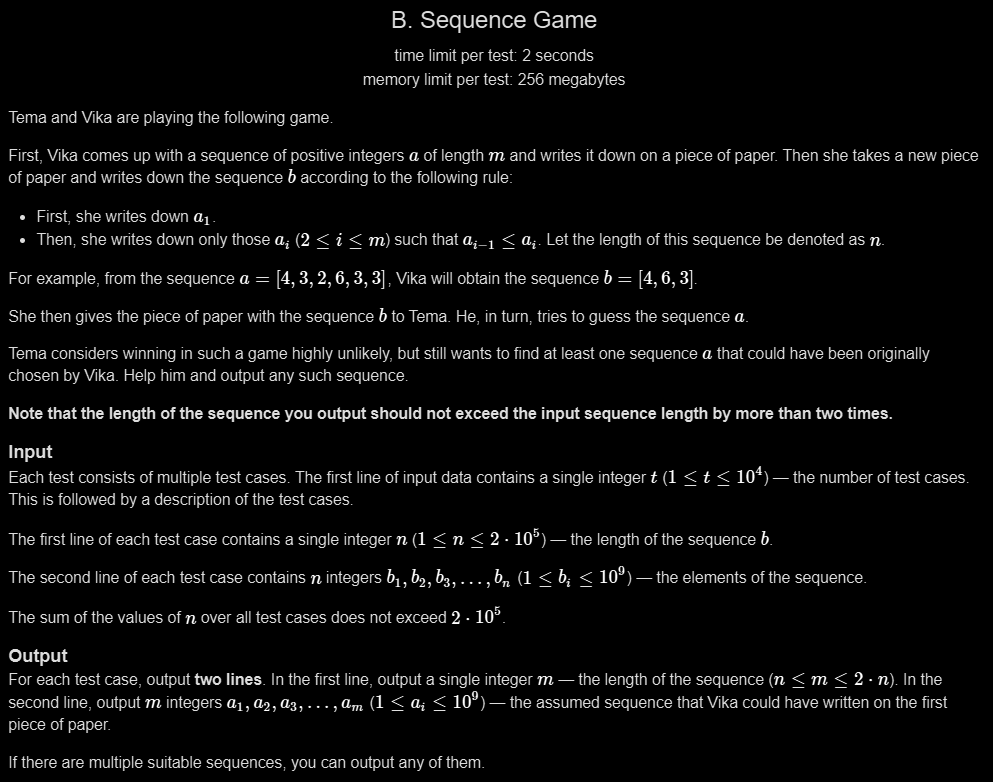

# B. Sequence Game

## 🖼 Problem q26


---

**Platform:** Codeforces  
**Topic:** Greedy / Construction  
**Difficulty:** Easy  

---

## 🧠 Idea in One Line
Insert duplicate element whenever sequence decreases.

---

## 🔍 Key Observation
- b keeps only non-decreasing elements from original
- If b[i] < b[i-1], we must insert extra value
- Duplicate ensures valid reconstruction

---

## 🚀 Approach
- Start with first element
- For each next element
- If decreasing → push twice
- Else push once

---

## 🪜 Algorithm Steps
1. Read test cases
2. Read n
3. Read array b
4. Push first element to a
5. Loop from i=1 to n-1
6. If b[i] >= b[i-1] push once
7. Else push twice
8. Print result

---

## ⏱ Time Complexity
O(n)

## 📦 Space Complexity
O(n)

---

## ⚠️ Edge Cases
- single element
- strictly increasing
- strictly decreasing
- equal elements
- large n

---

## 💻 Code Pattern to Remember
```cpp
#include <bits/stdc++.h>
using namespace std;

int main()
{
    int t;
    cin >> t;

    while (t--)
    {
        long long n;
        cin >> n;

        vector<long long> b(n), a;

        for (int i = 0; i < n; i++)
            cin >> b[i];

        a.push_back(b[0]);

        for (int i = 1; i < n; i++)
        {
            if (b[i] >= b[i - 1])
                a.push_back(b[i]);
            else
            {
                a.push_back(b[i]);
                a.push_back(b[i]);
            }
        }

        cout << a.size() << endl;

        for (auto it : a)
            cout << it << " ";

        cout << endl;
    }
}