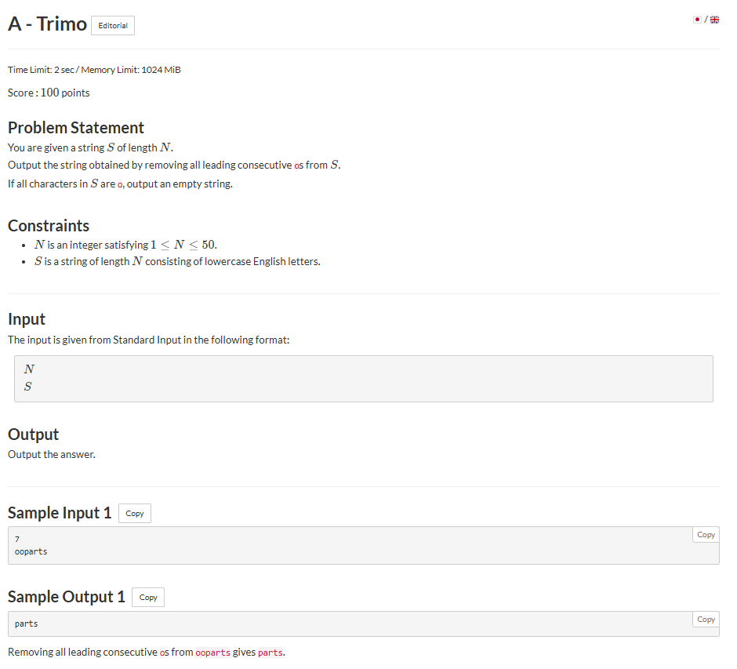

# A - Trimo

## 🖼 Problem 27


---

**Platform:** AtCoder  
**Topic:** String / Implementation  
**Difficulty:** Easy  

---

## 🧠 Idea in One Line
Skip leading 'o' characters and print remaining string.

---

## 🔍 Key Observation
- Only remove leading consecutive 'o'
- Stop at first non-'o'
- Print substring from that index

---

## 🚀 Approach
- Traverse string from start
- Count leading 'o'
- Print substring

---

## 🪜 Algorithm Steps
1. Read `n`
2. Read string `s`
3. Initialize index = 0
4. While character is 'o' increment index
5. Print substring from index

---

## ⏱ Time Complexity
O(n)

## 📦 Space Complexity
O(1)

---

## ⚠️ Edge Cases
- all characters 'o'
- no 'o' at start
- single character
- string length 1
- entire string removed

---

## 💻 Code Pattern to Remember
```cpp
#include <bits/stdc++.h>
using namespace std;

int main()
{
    int n;
    cin >> n;

    string s;
    cin >> s;

    int i = 0;

    while (i < n && s[i] == 'o')
        i++;

    cout << s.substr(i);

    return 0;
}