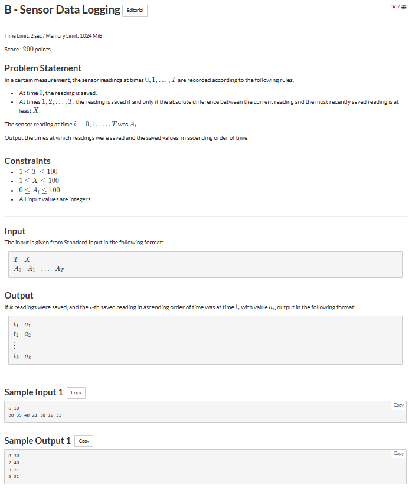

# B - Sensor Data Logging

## 🖼 Problem 28


---

**Platform:** AtCoder  
**Topic:** Simulation / Implementation  
**Difficulty:** Easy  

---

## 🧠 Idea in One Line
Save reading whenever difference from last saved reading ≥ X.

---

## 🔍 Key Observation
- First reading always saved
- Compare each reading with last saved value
- Save only if absolute difference ≥ X

---

## 🚀 Approach
- Store first reading
- Traverse array
- Compare with last saved value
- Print when condition satisfied

---

## 🪜 Algorithm Steps
1. Read `T , X`
2. Read array `A`
3. Save first reading
4. Loop from index 1 to T
5. Check absolute difference
6. If ≥ X print reading
7. Update last saved

---

## ⏱ Time Complexity
O(T)

## 📦 Space Complexity
O(1)

---

## ⚠️ Edge Cases
- X = 0 (all printed)
- no further readings saved
- negative differences
- T = 0
- same values

---

## 💻 Code Pattern to Remember
```cpp
#include <iostream>
#include <vector>
using namespace std;

int main()
{
    int T, X;
    cin >> T >> X;

    vector<int> A(T + 1);
    for (int i = 0; i <= T; i++)
        cin >> A[i];

    int last = A[0];
    cout << 0 << " " << last << "\n";

    for (int i = 1; i <= T; i++)
    {
        if (abs(A[i] - last) >= X)
        {
            cout << i << " " << A[i] << "\n";
            last = A[i];
        }
    }
}