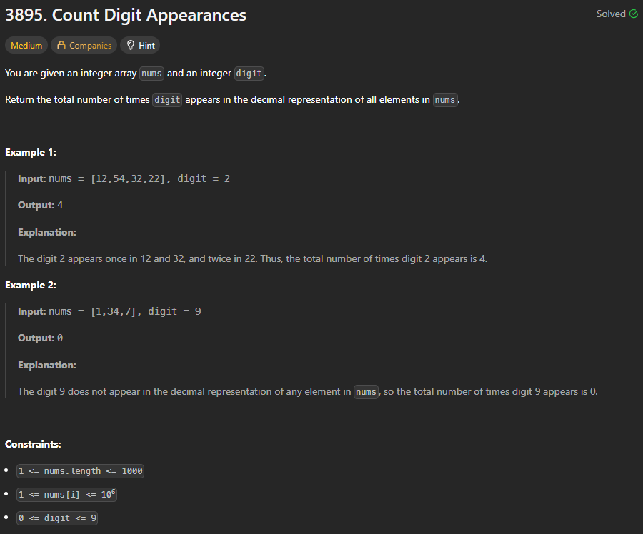

# 3895. Count Digit Appearances

## 🖼 Problem 29


---

**Platform:** LeetCode  
**Topic:** Math / Array / Digit Processing  
**Difficulty:** Medium  

---

## 🧠 Idea in One Line
Count occurrences of digit in each number by extracting digits.

---

## 🔍 Key Observation
- Process each number independently
- Extract digits using modulo
- Compare with target digit
- Sum total occurrences

---

## 🚀 Approach
- Loop through array
- For each number extract digits
- Count matching digit
- Add to total count

---

## 🪜 Algorithm Steps
1. Initialize count = 0
2. Traverse array
3. For each number extract digits
4. Compare with given digit
5. Increment count
6. Return total count

---

## ⏱ Time Complexity
O(n * digits)

## 📦 Space Complexity
O(1)

---

## ⚠️ Edge Cases
- digit = 0
- number = 0
- single digit numbers
- repeated digits
- large numbers
- empty count case

---

## 💻 Code Pattern to Remember
```cpp
class Solution {
public:
    int countDigitOccurrences(vector<int>& nums, int digit) {
        int n = nums.size();
        int c=0;
        for(int i=0; i<n; i++){
            c += digitcheck(nums[i], digit);
        }
        return c;
        
    }
    int digitcheck(int n, int digit){
        int c = 0;
        while(n>0){
            int rem = n%10;
            if(rem == digit) c++;
            n /= 10;
        }
        return c;
    }
};
