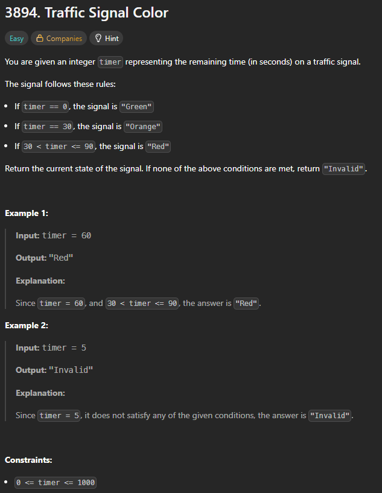

# 3894. Traffic Signal Color

## 🖼 Problem 30


---

**Platform:** LeetCode  
**Topic:** Conditional Statements / Implementation  
**Difficulty:** Easy  

---

## 🧠 Idea in One Line
Return color based on timer using conditional checks.

---

## 🔍 Key Observation
- timer = 0 → Green  
- timer = 30 → Orange  
- 30 < timer ≤ 90 → Red  
- otherwise → Invalid  

---

## 🚀 Approach
- Check conditions sequentially
- Return corresponding string
- Use if-else chain

---

## 🪜 Algorithm Steps
1. If timer == 0 return "Green"
2. Else if timer == 30 return "Orange"
3. Else if timer in range (30, 90] return "Red"
4. Else return "Invalid"

---

## ⏱ Time Complexity
O(1)

## 📦 Space Complexity
O(1)

---

## ⚠️ Edge Cases
- timer = 0
- timer = 30
- timer = 90
- timer < 0 (not possible but safe)
- timer between 1 and 29
- timer > 90

---

## 💻 Code Pattern to Remember
```cpp
class Solution {
public:
    string trafficSignal(int timer) {
        if(timer ==0) return "Green";
        else if(timer == 30) return "Orange";
        else if(timer>30 && timer <= 90) return "Red";
        else return "Invalid";
    }
};