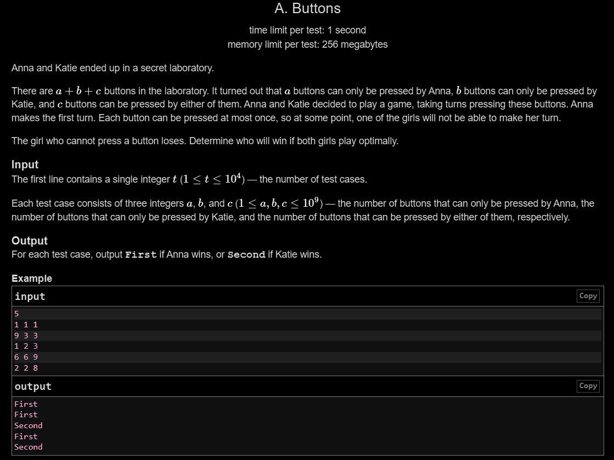

# A. Buttons Game

## 🖼 Problem 32


---

**Platform:** Codeforces  
**Topic:** Game Theory / Greedy  
**Difficulty:** Easy  

---

## 🧠 Idea in One Line
Winner depends on comparison of a and b, with parity of c affecting tie.

---

## 🔍 Key Observation
- Players alternate moves
- If c is odd → First player gets extra move advantage
- If c is even → equal turns
- Compare a and b:
  - odd c → a >= b → First wins
  - even c → a > b → First wins

---

## 🚀 Approach
- Check parity of c
- Apply condition based on parity
- Compare a and b

---

## 🪜 Algorithm Steps
1. Read test cases
2. Read a, b, c
3. If c is odd:
4. → if a >= b → First
5. Else → Second
6. If c is even:
7. → if a > b → First
8. Else → Second

---

## ⏱ Time Complexity
O(1)

## 📦 Space Complexity
O(1)

---

## ⚠️ Edge Cases
- a == b
- c = 0
- c = 1
- a or b = 0
- large values

---

## 💻 Code Pattern to Remember
```cpp
#include <iostream>
using namespace std;

int main()
{
    int t;
    cin >> t;

    while (t--)
    {
        int a, b, c;
        cin >> a >> b >> c;

        if (c % 2 == 1)
        {
            if (a >= b)
                cout << "First" << endl;
            else
                cout << "Second" << endl;
        }
        else
        {
            if (a > b)
                cout << "First" << endl;
            else
                cout << "Second" << endl;
        }
    }

    return 0;
}