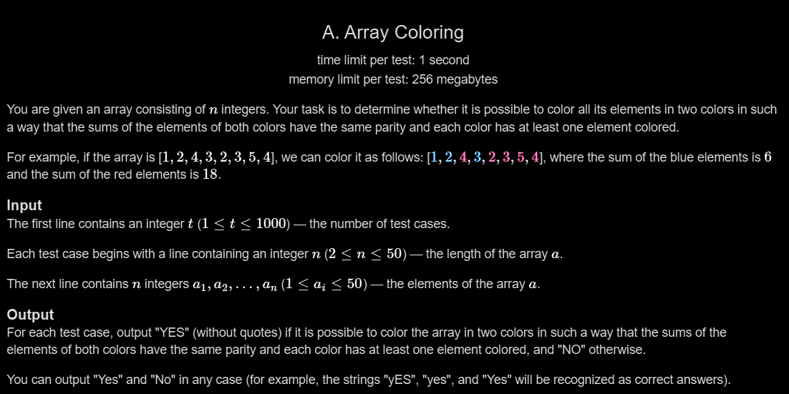

# A. Array Coloring

## 🖼 Problem 33


---

**Platform:** Codeforces  
**Topic:** Math / Parity  
**Difficulty:** Easy  

---

## 🧠 Idea in One Line
If total sum is even → possible, else not.

---

## 🔍 Key Observation
- We need to split into two groups with same parity
- Total sum must be even
- If total sum is odd → impossible

---

## 🚀 Approach
- Calculate total sum
- Check parity of sum
- If even → YES
- Else → NO

---

## 🪜 Algorithm Steps
1. Read test cases
2. Read n
3. Compute sum of array
4. If sum % 2 == 0 → YES
5. Else → NO

---

## ⏱ Time Complexity
O(n)

## 📦 Space Complexity
O(1)

---

## ⚠️ Edge Cases
- all even numbers
- all odd numbers
- mix of even and odd
- single odd causing odd sum
- n = 2

---

## 💻 Code Pattern to Remember
```cpp
#include <iostream>
using namespace std;

int main(){
    int t;
    cin >> t;

    while(t--){
        int n, m;
        cin >> n;

        long sum = 0;

        for(int i=0; i<n; i++){
            cin >> m;
            sum += m;
        }

        if(sum % 2 == 0)
            cout << "YES" << endl;
        else
            cout << "NO" << endl;
    }

    return 0;
}