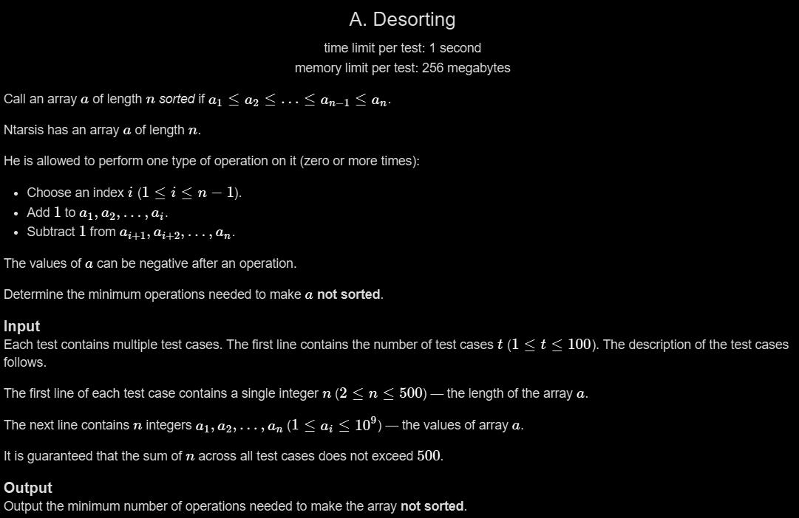

# A. Desorting

## 🖼 Problem 34


---

**Platform:** Codeforces  
**Topic:** Greedy / Math  
**Difficulty:** Easy  

---

## 🧠 Idea in One Line
Find minimum operations needed to break sorted order using smallest adjacent difference.

---

## 🔍 Key Observation
- If already not sorted → answer = 0
- Otherwise:
  - Need to make some pair violate order
  - Focus on adjacent differences
- Minimum operations comes from smallest `(arr[i+1] - arr[i])`

---

## 🚀 Approach
- Check if array already unsorted → return 0
- Else:
  - For each adjacent pair:
    - Compute difference
    - Required operations = diff/2 + 1
  - Take minimum

---

## 🪜 Algorithm Steps
1. Read test cases
2. Read n and array
3. Initialize answer = large value
4. Loop from i=0 to n-2
5. If arr[i] > arr[i+1] → answer = 0
6. Else:
7. Compute diff = arr[i+1] - arr[i]
8. Compute ops = diff/2 + 1
9. Take minimum
10. Print answer

---

## ⏱ Time Complexity
O(n)

## 📦 Space Complexity
O(1)

---

## ⚠️ Edge Cases
- already unsorted → 0
- all equal elements
- strictly increasing
- large values
- n = 2

---

## 💻 Code Pattern to Remember
```cpp
#include <bits/stdc++.h>
using namespace std;

int main(){
    int t;
    cin >> t;

    while(t--){
        int n;
        cin >> n;

        int arr[n];
        for(int i=0; i<n; i++){
            cin >> arr[i];
        }

        int operation = INT_MAX;

        for(int i=0; i<n-1; i++){
            if(arr[i] <= arr[i+1]){
                int diff = arr[i+1] - arr[i];
                int required_Operation = diff/2 + 1;
                operation = min(operation, required_Operation);
            }
            else{
                operation = 0;
            }
        }

        cout << operation << endl;
    }

    return 0;
}