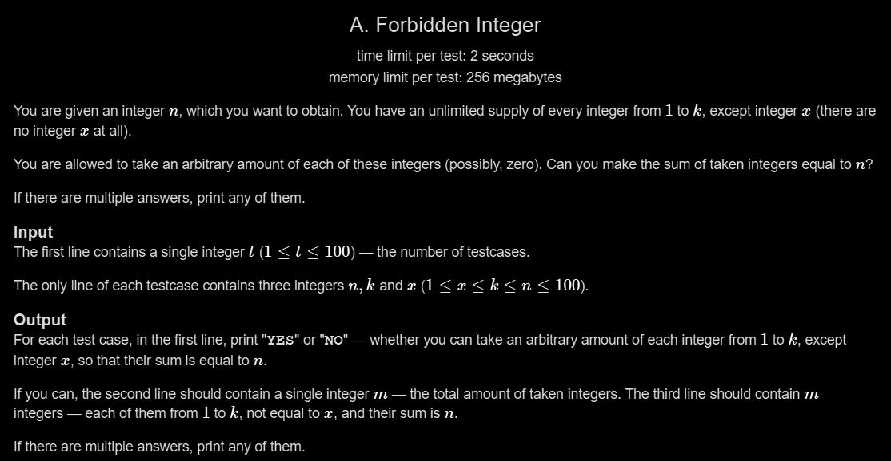

# A. Forbidden Integer

## 🖼 Problem 35


---

**Platform:** Codeforces  
**Topic:** Greedy / Construction  
**Difficulty:** Easy  

---

## 🧠 Idea in One Line
Avoid forbidden number x by constructing sum using allowed integers (mostly 1, 2, 3).

---

## 🔍 Key Observation
- If x ≠ 1 → use all 1s
- If x = 1:
  - Use 2s and possibly one 3
- Edge case: when k is too small → impossible

---

## 🚀 Approach
- Case 1: x ≠ 1
  - Use n times 1
- Case 2: x = 1
  - If k == 1 → impossible
  - If k == 2:
    - If n is odd → impossible
    - Else use all 2s
  - If k ≥ 3:
    - If n is even → use all 2s
    - Else → use some 2s + one 3

---

## 🪜 Algorithm Steps
1. Read test cases
2. Read n, k, x
3. If x ≠ 1:
4. → print n ones
5. Else:
6. → check k constraints
7. → construct using 2 and 3
8. Print result

---

## ⏱ Time Complexity
O(n)

## 📦 Space Complexity
O(1)

---

## ⚠️ Edge Cases
- x = 1 and k = 1 → NO
- x = 1 and k = 2 and n odd → NO
- n = 1
- k small values
- large n

---

## 💻 Code Pattern to Remember
```cpp
#include <iostream>
using namespace std;

int main()
{
    int t;
    cin >> t;

    while (t--)
    {
        int n, k, x;
        cin >> n >> k >> x;

        if (x != 1)
        {
            cout << "YES" << endl;
            cout << n << endl;

            for (int i = 0; i < n; i++)
                cout << 1 << " ";

            cout << "\n";
        }
        else
        {
            if (k == 1 || (k == 2 && n % 2 == 1))
            {
                cout << "NO" << endl;
            }
            else
            {
                if (n % 2 == 0)
                {
                    cout << "YES" << endl;
                    cout << n / 2 << endl;

                    for (int i = 0; i < n / 2; i++)
                        cout << 2 << " ";

                    cout << "\n";
                }
                else
                {
                    cout << "YES" << endl;
                    cout << (n - 3) / 2 + 1 << endl;

                    for (int i = 0; i < (n - 3) / 2; i++)
                        cout << 2 << " ";

                    cout << 3 << endl;
                }
            }
        }
    }

    return 0;
}