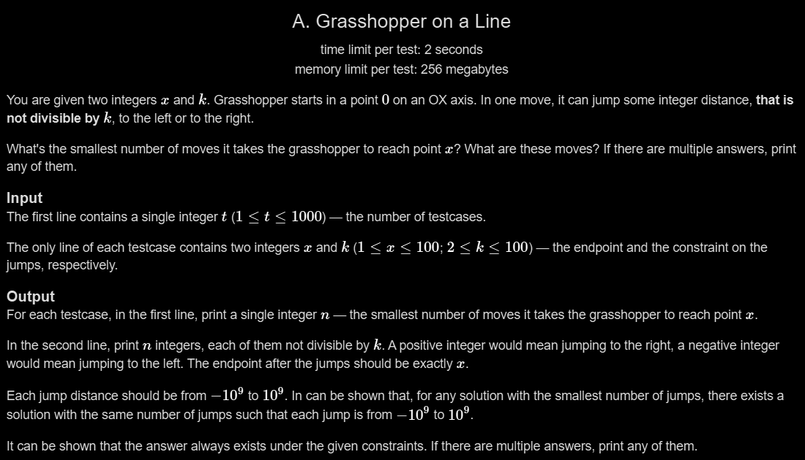

# A. Grasshopper on a Line

## 🖼 Problem 36


---

**Platform:** Codeforces  
**Topic:** Math / Greedy / Construction  
**Difficulty:** Easy  

---

## 🧠 Idea in One Line
If x is not divisible by k → jump directly, otherwise split into two valid jumps.

---

## 🔍 Key Observation
- Every jump must NOT be divisible by k
- If x % k ≠ 0:
  - One jump directly to x
- Else:
  - Split into two jumps:
    - 1
    - x - 1
- Both are not divisible by k

---

## 🚀 Approach
- Check divisibility of x by k
- If not divisible:
  - Print 1 move
- Else:
  - Print 2 moves
  - Use jumps 1 and x-1

---

## 🪜 Algorithm Steps
1. Read test cases
2. Read x and k
3. If x % k != 0:
4. → print 1 and x
5. Else:
6. → print 2
7. → print 1 and x-1

---

## ⏱ Time Complexity
O(1)

## 📦 Space Complexity
O(1)

---

## ⚠️ Edge Cases
- x divisible by k
- x not divisible by k
- x = 1
- k > x
- small values

---

## 💻 Code Pattern to Remember
```cpp
#include <iostream>
using namespace std;

int main()
{
    int t;
    cin >> t;

    while (t--)
    {
        int x, k;
        cin >> x >> k;

        if (x % k == 0)
        {
            cout << 2 << endl;
            cout << 1 << " " << x - 1 << endl;
        }
        else
        {
            cout << 1 << endl;
            cout << x << endl;
        }
    }

    return 0;
}