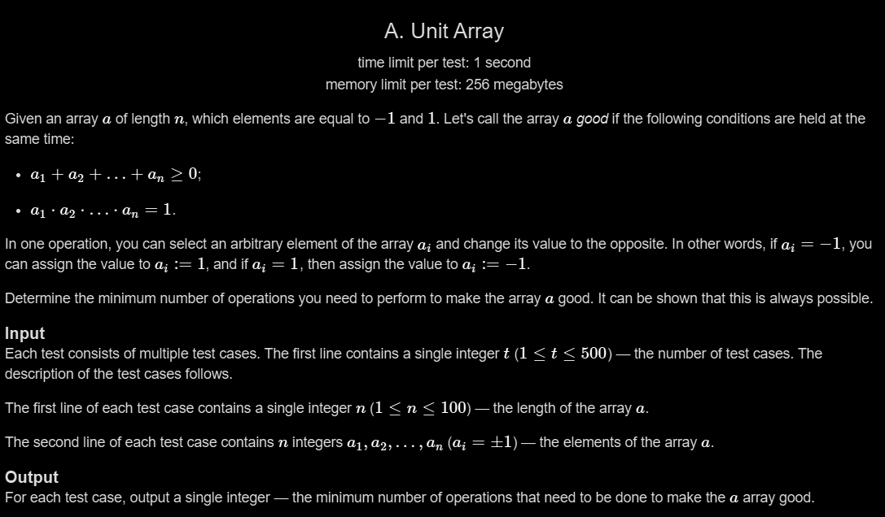

# A. Unit Array

## 🖼 Problem 37


---

**Platform:** Codeforces  
**Topic:** Greedy / Math  
**Difficulty:** Easy  

---

## 🧠 Idea in One Line
Convert minimum `-1` values into `1` until sum becomes non-negative and count of `-1` becomes even.

---

## 🔍 Key Observation
A good array must satisfy:

1. Sum of array ≥ 0
2. Product of all elements = 1

Since elements are only `1` and `-1`:

- Product becomes `1` only when number of `-1` is even
- Sum becomes non-negative when count of `1` is at least count of `-1`

Each operation flips one element.

---

## 🚀 Approach
- Count positive (`1`) and negative (`-1`) numbers
- While:
  - negatives are greater than positives
  - OR negatives are odd
- Flip one `-1` into `1`
- Count operations

---

## 🪜 Algorithm Steps
1. Read test cases
2. Count positives and negatives
3. Initialize operations = 0
4. While:
   - positive < negative
   - OR negative count is odd
5. Convert one `-1` to `1`
6. Increment operations
7. Print operations

---

## ⏱ Time Complexity
O(n)

## 📦 Space Complexity
O(1)

---

## ⚠️ Edge Cases
- All elements are `-1`
- Negative count already even
- Sum already non-negative
- Single element array
- Equal positives and negatives

---

## 💻 Code Pattern to Remember
```cpp
#include <iostream>
#include <vector>
using namespace std;

int main()
{
    int t;
    cin >> t;

    while (t--)
    {
        int n;
        cin >> n;

        int positive = 0;
        int negative = 0;

        vector<int> a(n);

        for (int i = 0; i < n; i++)
        {
            cin >> a[i];

            if (a[i] == 1)
                positive++;
            else
                negative++;
        }

        int operation = 0;

        while (positive < negative || negative % 2 == 1)
        {
            operation++;
            positive++;
            negative--;
        }

        cout << operation << endl;
    }

    return 0;
}