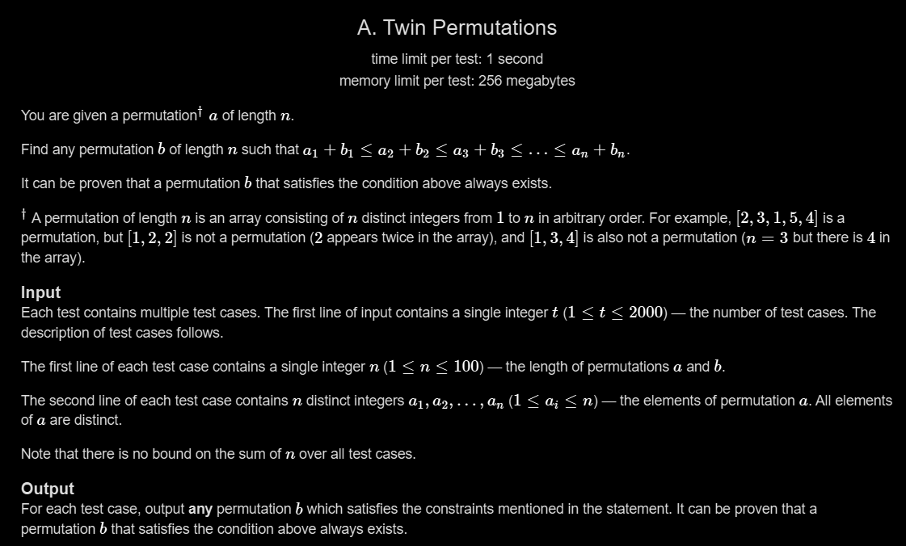

# A. Twin Permutations

## 🖼 Problem 38


---

**Platform:** Codeforces  
**Topic:** Math / Constructive Algorithms / Permutation  
**Difficulty:** Easy  

---

## 🧠 Idea in One Line
Construct permutation `b` such that every `a[i] + b[i]` becomes equal to `n + 1`.

---

## 🔍 Key Observation
If we choose:

```cpp
b[i] = n + 1 - a[i]
```

then:

```cpp
a[i] + b[i] = n + 1
```

for every index.

So:

```cpp
a1+b1 ≤ a2+b2 ≤ ... ≤ an+bn
```

becomes:

```cpp
n+1 ≤ n+1 ≤ ... ≤ n+1
```

which is always true.

---

## 🚀 Approach
- Read permutation `a`
- Construct another permutation `b`
- For every element:

```cpp
b[i] = n + 1 - a[i]
```

- Print permutation `b`

---

## 🪜 Algorithm Steps
1. Read test cases
2. Read integer `n`
3. Read permutation `a`
4. Traverse the array
5. Compute:

```cpp
n + 1 - a[i]
```

6. Print the resulting permutation

---

## 🔎 Problem Restatement
We are given a permutation `a`.

We need to create another permutation `b` such that:

```cpp
a1+b1 ≤ a2+b2 ≤ ... ≤ an+bn
```

A very easy way is to make all sums equal.

---

## 🔒 Hidden Constraints / Insights
- `a` is already a permutation from `1` to `n`
- If sums are equal, condition automatically satisfies
- Complement values form another valid permutation
- No sorting required
- O(n) solution is enough

---

## 🧪 Small Example Walkthrough

### Input
```cpp
n = 5
a = [1, 3, 5, 2, 4]
```

### Construct b
```cpp
b[i] = n + 1 - a[i]

b = [5, 3, 1, 4, 2]
```

### Check Sums
```cpp
1 + 5 = 6
3 + 3 = 6
5 + 1 = 6
2 + 4 = 6
4 + 2 = 6
```

### Output
```cpp
5 3 1 4 2
```

### Why?
All pair sums are equal, so the non-decreasing condition is satisfied.

---

## ⏱ Time Complexity
```cpp
O(n)
```

---

## 📦 Space Complexity
```cpp
O(1)
```

(extra space ignored apart from input storage)

---

## ⚠️ Important Edge Cases
- `n = 1`
- Already sorted permutation
- Reverse permutation
- Random order permutation
- Largest possible `n`

---

## 💻 Code Pattern to Remember
```cpp
#include <bits/stdc++.h>
using namespace std;

int main() {
    int t;
    cin >> t;

    while(t--) {
        int n;
        cin >> n;

        vector<int> a(n);

        for(int i = 0; i < n; i++) {
            cin >> a[i];
        }

        for(int i = 0; i < n; i++) {
            cout << n + 1 - a[i] << " ";
        }

        cout << "\n";
    }

    return 0;
}
```

---

## 🧩 Pattern Used
- Constructive Algorithm
- Complement Mapping
- Permutation Construction
- Simple Math Observation

---

## ❌ Mistakes to Avoid
- Writing `n - a[i]` instead of `n + 1 - a[i]`
- Forgetting permutations are 1-based values
- Trying unnecessary sorting
- Overcomplicating the construction
- Confusing indices with values

---

## 🔁 Similar Problems
- Permutation Construction Problems
- Complement Array Problems
- Symmetric Permutation
- Codeforces Constructive Problems

---

## 📌 Quick Revision Notes
- Make every pair sum equal
- Use complement with respect to `n+1`
- `b[i] = n+1-a[i]`
- Complement of a permutation is also a permutation
- Direct O(n) construction

---

## 🧠 Interview Discussion Points
- Why does complement mapping always work?
- Can multiple valid answers exist?
- What properties make `b` a permutation?
- Can we generalize this for constant pair sums?

---

## 🏁 Final Takeaway
This problem shows how a simple mathematical observation can convert a permutation construction problem into a direct O(n) solution.