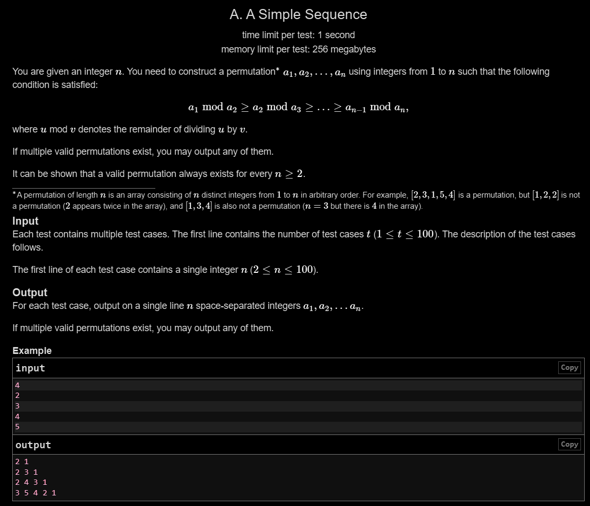

# A. A Simple Sequence

## 🖼 Problem 51


---

**Platform:** Codeforces  
**Topic:** Greedy / Permutation  
**Difficulty:** Easy  

---

## 🧠 Idea in One Line
Print numbers in decreasing order from n to 1.

---

## 🔍 Key Observation
- Condition involves modulo decreasing
- If we take strictly decreasing sequence:
  - a[i] % a[i+1] = remainder < a[i+1]
- This naturally satisfies required condition

---

## 🚀 Approach
- Simply output n → 1
- This guarantees valid permutation

---

## 🪜 Algorithm Steps
1. Read test cases
2. Read n
3. Loop from n to 1
4. Print elements

---

## ⏱ Time Complexity
O(n)

## 📦 Space Complexity
O(1)

---

## ⚠️ Edge Cases
- n = 2
- small n
- multiple test cases
- ensure no duplicates
- correct order

---

## 💻 Code Pattern to Remember
```cpp
#include <iostream>
using namespace std;

int main(){
    int t;
    cin >> t;

    while(t--){
        int n;
        cin >> n;

        for(int i = n; i >= 1; i--){
            cout << i << " ";
        }

        cout << "\n";
    }

    return 0;
}