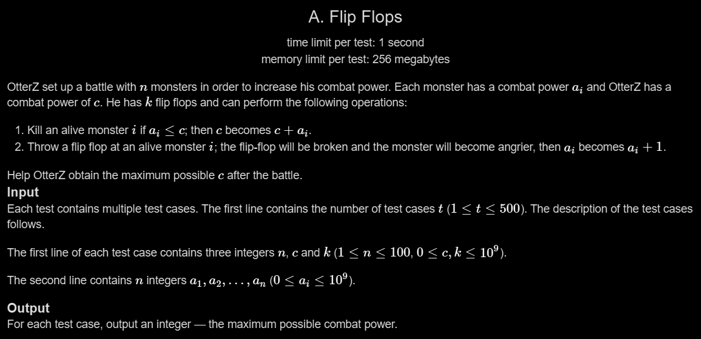

# A. Flip Flops

## 🖼 Problem 52


---

**Platform:** Codeforces  
**Topic:** Greedy / Sorting  
**Difficulty:** Easy  

---

## 🧠 Idea in One Line
Sort monsters and use flips wisely to maximize combat power.

---

## 🔍 Key Observation
- You can only defeat monster if `a[i] ≤ c`
- Flip increases monster power but helps increase future gain
- Use flips to increase weakest monsters first
- Greedy: process in sorted order

---

## 🚀 Approach
- Sort array
- Traverse from smallest
- If monster ≤ c:
  - Use flips optimally
  - Increase c accordingly
- Stop when cannot defeat further

---

## 🪜 Algorithm Steps
1. Read test cases
2. Read `n, c, k`
3. Read array
4. Sort array
5. Loop through array:
6. If `a[i] > c` → break
7. Use flips: `o = min(k, c - a[i])`
8. Reduce k
9. Increase c by `(a[i] + o)`
10. Print final c

---

## ⏱ Time Complexity
O(n log n)

## 📦 Space Complexity
O(n)

---

## ⚠️ Edge Cases
- no flips available (k = 0)
- all monsters too strong
- already large c
- single monster
- large k

---

## 💻 Code Pattern to Remember
```cpp
#include <iostream>
#include <algorithm>
#include <vector>
using namespace std;

int main()
{
    int t;
    cin >> t;

    while (t--)
    {
        int n;
        long long c, k;
        cin >> n >> c >> k;

        vector<long long> a(n);

        for (int i = 0; i < n; i++)
            cin >> a[i];

        sort(a.begin(), a.end());

        for (int i = 0; i < n; i++)
        {
            if (a[i] > c)
                break;

            long long o = min(k, c - a[i]); // how many flips we can use on this monster
            k -= o;
            c += a[i] + o;
        }

        cout << c << endl;
    }

    return 0;
}