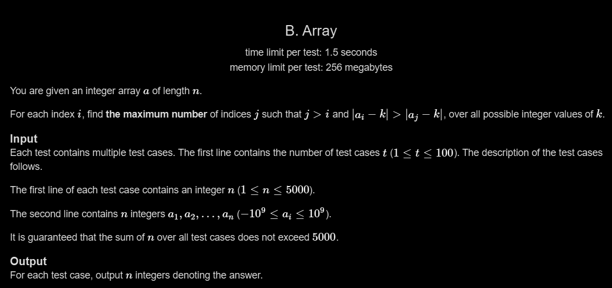

# B. Array

## 🖼 Problem 53


---

**Platform:** Codeforces  
**Topic:** Math / Observation / Brute Force  
**Difficulty:** Easy-Medium  

---

## 🧠 Idea in One Line
For each index, count how many elements after it are greater and smaller, then take the maximum.

---

## 🔍 Key Observation
We need to maximize:

```cpp
|a[i] - k| > |a[j] - k|
```

For any pair `(a[i], a[j])`:

- If `a[i] > a[j]`, we can choose a very small `k`
- If `a[i] < a[j]`, we can choose a very large `k`

So for every index `i`, the answer becomes:

```cpp
max(countGreater, countSmaller)
```

where:

- `countGreater` = elements greater than `a[i]`
- `countSmaller` = elements smaller than `a[i]`

after index `i`.

---

## 🚀 Approach
- Traverse every index `i`
- Count:
  - elements greater than `a[i]`
  - elements smaller than `a[i]`
- Store:

```cpp
max(greater, smaller)
```

- Print answers

---

## 🪜 Algorithm Steps
1. Read test cases
2. Read array
3. For every index `i`
4. Traverse all `j > i`
5. Count greater and smaller elements
6. Store maximum count
7. Print result array

---

## 🔎 Problem Restatement
For every element in the array, we want to find the maximum number of later elements that can become closer to some integer `k` than `a[i]`.

Using observations, this reduces to simply counting how many later elements are larger or smaller.

---

## 🔒 Hidden Constraints / Insights
- Constraints allow O(n²)
- Only relative ordering matters
- Exact value of `k` is not needed
- We only care whether elements are greater or smaller
- Equal elements do not contribute

---

## 🧪 Small Example Walkthrough

### Input
```cpp
a = [3, 1, 4, 2]
```

### For i = 0
```cpp
a[i] = 3

greater = 1   // 4
smaller = 2   // 1, 2

answer = 2
```

### For i = 1
```cpp
a[i] = 1

greater = 2   // 4, 2
smaller = 0

answer = 2
```

### Final Output
```cpp
2 2 0 0
```

---

## ⏱ Time Complexity
```cpp
O(n²)
```

---

## 📦 Space Complexity
```cpp
O(1)
```

(extra space excluding input array)

---

## ⚠️ Important Edge Cases
- All equal elements
- Strictly increasing array
- Strictly decreasing array
- Single element array
- Negative numbers
- Duplicate values

---

## 💻 Code Pattern to Remember
```cpp
#include <iostream>
#include <vector>
#include <algorithm>
using namespace std;

int main()
{
    int t;
    cin >> t;

    while (t--)
    {
        int n;
        cin >> n;

        vector<int> a(n);

        for (int i = 0; i < n; i++)
        {
            cin >> a[i];
        }

        for (int i = 0; i < n; i++)
        {
            int greater = 0;
            int smaller = 0;

            for (int j = i + 1; j < n; j++)
            {
                if (a[i] < a[j])
                    greater++;
                else if (a[i] > a[j])
                    smaller++;
            }

            a[i] = max(greater, smaller);
        }

        for (int i = 0; i < n; i++)
        {
            cout << a[i] << " ";
        }

        cout << "\n";
    }

    return 0;
}
```

---

## 🧩 Pattern Used
- Brute Force
- Observation Based Math
- Pair Comparison
- Counting Technique

---

## ❌ Mistakes to Avoid
- Counting equal elements
- Using updated values accidentally
- Confusing greater/smaller logic
- Forgetting `j > i`
- Using absolute difference directly unnecessarily

---

## 🔁 Similar Problems
- Counting Inversions
- Relative Order Problems
- Pair Comparison Problems
- Observation Based Arrays

---

## 📌 Quick Revision Notes
- Only compare relative values
- Greater and smaller counts matter
- Equal values ignored
- Answer = max(greater, smaller)
- O(n²) works due to constraints

---

## 🧠 Interview Discussion Points
- Why does choosing very large/small `k` work?
- Can this be optimized further?
- What happens with duplicate values?
- Why are equal elements ignored?

---

## 🏁 Final Takeaway
This problem demonstrates how a complex mathematical condition can often be simplified into a simple counting observation.