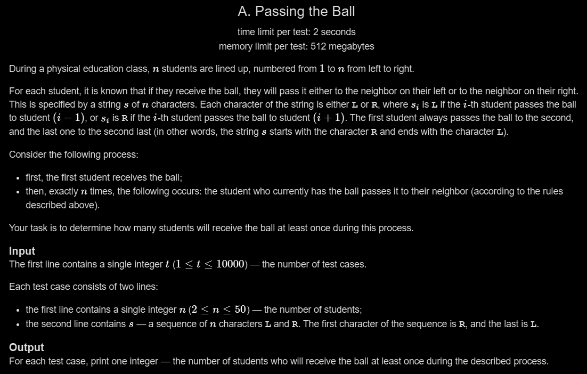

# A. Passing the Ball

## 🖼 Problem 54


---

**Platform:** Codeforces  
**Topic:** Simulation / Strings  
**Difficulty:** Easy  

---

## 🧠 Idea in One Line
The answer is the position of the first student who passes the ball to the left (`L`).

---

## 🔍 Key Observation
- The ball starts from student `1`
- Initially, all students pass to the right (`R`)
- As soon as we reach the first `L`, the ball starts moving back

So all students from:

```cpp
1 → first 'L'
```

will receive the ball at least once.

Hence:

```cpp
answer = index of first 'L' + 1
```

(using 1-based indexing)

---

## 🚀 Approach
- Read the string
- Find the first occurrence of `'L'`
- Print its position (`i + 1`)

---

## 🪜 Algorithm Steps
1. Read test cases
2. Read `n`
3. Read string `s`
4. Traverse the string
5. Find first `'L'`
6. Print its 1-based index

---

## 🔎 Problem Restatement
Students are standing in a line.

Each student passes the ball either:
- Left (`L`)
- Right (`R`)

Starting from student `1`, determine how many students will touch the ball.

---

## 🔒 Hidden Constraints / Insights
- String always starts with `R`
- String always ends with `L`
- Ball moves right until first `L`
- After reaching first `L`, movement reverses
- Only prefix before first `L` matters

---

## 🧪 Small Example Walkthrough

### Input
```cpp
n = 5
s = "RRLLL"
```

### Process
```cpp
Student 1 -> 2
Student 2 -> 3
Student 3 passes left
```

Students receiving ball:
```cpp
1, 2, 3
```

### Output
```cpp
3
```

---

## ⏱ Time Complexity
```cpp
O(n)
```

---

## 📦 Space Complexity
```cpp
O(1)
```

---

## ⚠️ Important Edge Cases
- First `L` appears immediately
- All possible `R` before last `L`
- Minimum size string
- Alternating directions

---

## 💻 Code Pattern to Remember
```cpp
#include <iostream>
using namespace std;

int main()
{
    int t;
    cin >> t;

    while (t--)
    {
        int n;
        cin >> n;

        string s;
        cin >> s;

        int count = 0;

        for (int i = 0; i < n; i++)
        {
            if (s[i] == 'L')
            {
                count = i + 1;
                break;
            }
        }

        cout << count << endl;
    }

    return 0;
}
```

---

## 🧩 Pattern Used
- String Traversal
- Observation Based Simulation
- Prefix Analysis

---

## ❌ Mistakes to Avoid
- Taking input character-by-character incorrectly
- Forgetting 1-based indexing
- Continuing after first `'L'`
- Confusing visited students with total passes

---

## 🔁 Similar Problems
- Ball Passing Simulation
- First Occurrence Problems
- Prefix Traversal Problems
- Direction Based Simulation

---

## 📌 Quick Revision Notes
- Ball starts from student 1
- Moves right until first `L`
- Answer = first `L` position
- Use 1-based indexing
- Simple O(n) traversal

---

## 🧠 Interview Discussion Points
- Why does only the first `L` matter?
- Can simulation be avoided?
- What if the string didn't end with `L`?
- Can we solve in constant space?

---

## 🏁 Final Takeaway
This problem teaches how careful observation can replace full simulation with a simple first-occurrence search.