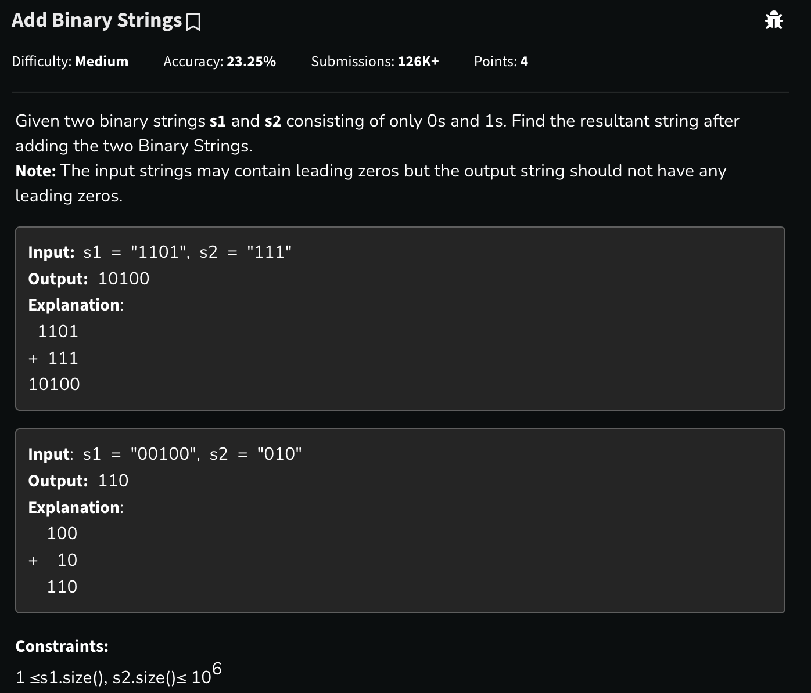

# Add Binary Strings

## 🖼 Problem 60


---

**Platform:** GeeksforGeeks  
**Topic:** Strings / Binary Addition  
**Difficulty:** Medium  

---

## 🧠 Idea in One Line
Simulate normal binary addition from right to left using carry.

---

## 🔍 Key Observation
Binary addition works exactly like decimal addition.

Rules:

```cpp
0 + 0 = 0
0 + 1 = 1
1 + 1 = 10
1 + 1 + 1 = 11
```

At every step:
- digit = `sum % 2`
- carry = `sum / 2`

---

## 🚀 Approach
- Start from the last character of both strings
- Add digits along with carry
- Store resulting bit
- Reverse final string
- Remove leading zeros

---

## 🪜 Algorithm Steps
1. Initialize pointers at end of both strings
2. Initialize `carry = 0`
3. Traverse while digits or carry exist
4. Add current bits
5. Append `(sum % 2)` to answer
6. Update carry `(sum / 2)`
7. Reverse answer
8. Remove leading zeros
9. Return final binary string

---

## 🔎 Problem Restatement
We are given two binary strings.

We need to return their sum as another binary string without leading zeros.

---

## 🔒 Hidden Constraints / Insights
- String size can be very large (`10^6`)
- Cannot convert directly to integers
- Must perform string-based addition
- Leading zeros may exist in input
- Output should not contain leading zeros

---

## 🧪 Small Example Walkthrough

### Input
```cpp
s1 = "1101"
s2 = "111"
```

### Process
```cpp
   1101
 + 0111
 -------
  10100
```

### Step-by-Step
```cpp
1 + 1 = 0 carry 1
0 + 1 + carry = 0 carry 1
1 + 1 + carry = 1 carry 1
1 + 0 + carry = 0 carry 1
remaining carry = 1
```

### Output
```cpp
10100
```

---

## ⏱ Time Complexity
```cpp
O(max(n, m))
```

---

## 📦 Space Complexity
```cpp
O(max(n, m))
```

---

## ⚠️ Important Edge Cases
- Different string lengths
- Final carry remaining
- Both strings are `"0"`
- Leading zeros in input
- One string empty-like `"0000"`

---

## 💻 Code Pattern to Remember
```cpp
class Solution {
public:
    string addBinary(string& s1, string& s2) {

        int i = s1.length() - 1;
        int j = s2.length() - 1;

        int carry = 0;
        string ans = "";

        while(i >= 0 || j >= 0 || carry) {

            int sum = carry;

            if(i >= 0) {
                sum += s1[i] - '0';
                i--;
            }

            if(j >= 0) {
                sum += s2[j] - '0';
                j--;
            }

            ans += (sum % 2) + '0';

            carry = sum / 2;
        }

        reverse(ans.begin(), ans.end());

        int pos = ans.find('1');

        if(pos == string::npos)
            return "0";

        return ans.substr(pos);
    }
};
```

---

## 🧩 Pattern Used
- String Simulation
- Carry Based Addition
- Two Pointer Traversal
- Binary Arithmetic

---

## ❌ Mistakes to Avoid
- Forgetting final carry
- Forgetting to reverse answer
- Using integer conversion for huge strings
- Not removing leading zeros
- Confusing char `'0'` with integer `0`

---

## 🔁 Similar Problems
- Add Strings
- Multiply Strings
- Binary Addition
- Big Integer Arithmetic
- Add Two Numbers

---

## 📌 Quick Revision Notes
- Traverse from right to left
- Maintain carry
- `sum % 2` gives current bit
- `sum / 2` gives carry
- Reverse at end
- Remove leading zeros

---

## 🧠 Interview Discussion Points
- Why not use integer conversion?
- How to optimize space?
- Can this work for any base?
- Difference between binary and decimal addition logic?

---

## 🏁 Final Takeaway
This problem teaches how large-number arithmetic can be simulated efficiently using strings and carry propagation.